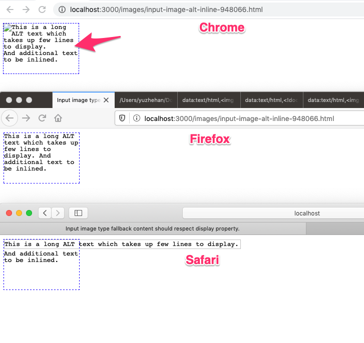
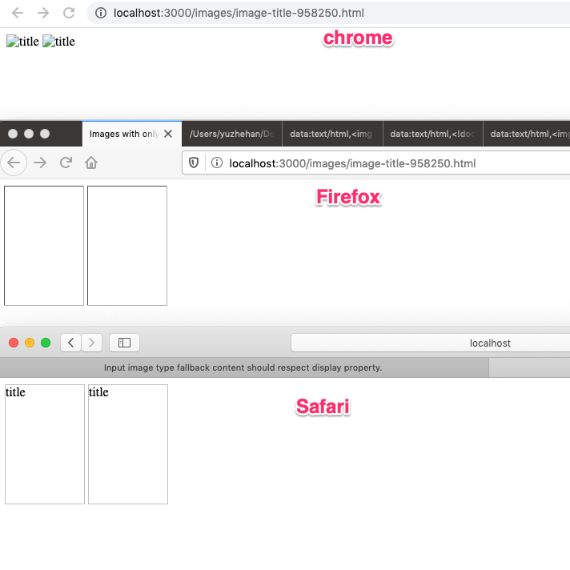
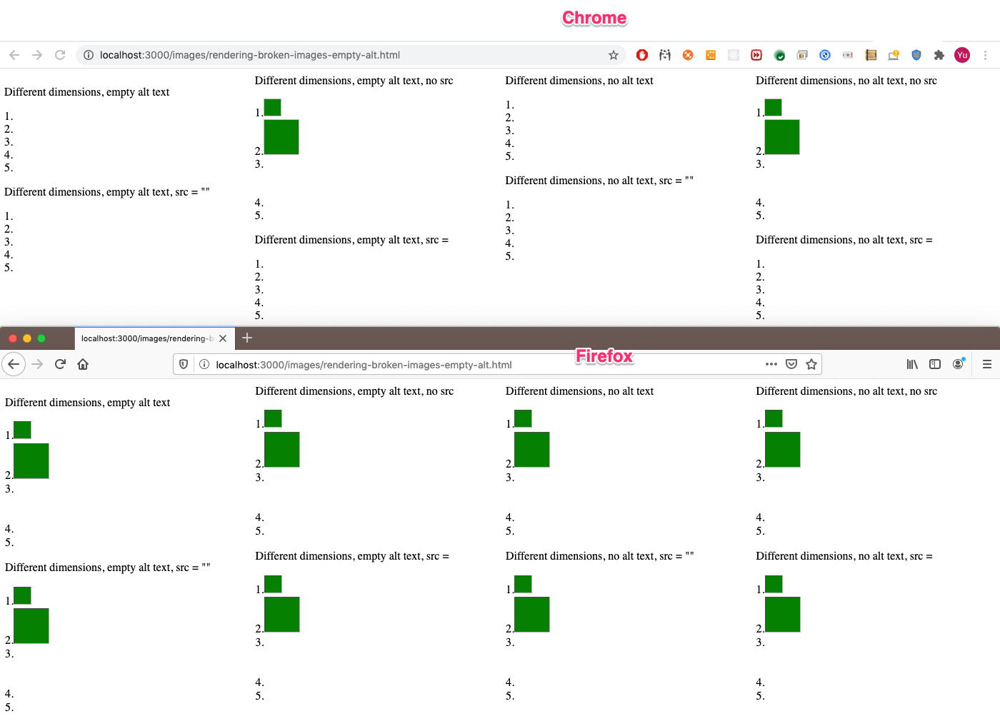
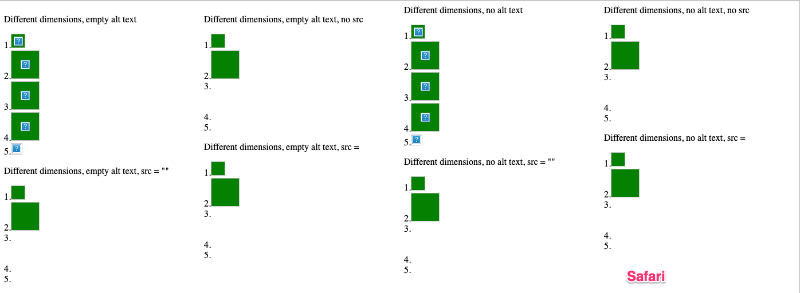

## image fallback content inconsistencies between browsers

This document is to showcase the inconsistencies of rendering fallback content between browsers.

The following browser versions are used for testing:
* Chrome: 85.0.4173.0
* Firefox: 77.0.1 (64-bit)
* Safari: Version 13.1 (14609.1.20.111.8)

### display:inline for <input type=image> when it's not rendering an image (ALT text) should use a true CSS inline box

* Bug: https://crbug.com/948066
* Test: [input-image alt inline](test-files/input-image-alt-inline-948066.html)
* Rendering:
 
 
### `img` without `src` and with `title` doesn't respect dimensions
 
 * Bug: https://crbug.com/958250
 * Test: [title w/ only title](test-files/image-title-958250.html)
 * Rendering:
  
  
***  Alt text on broken images overriding css dimensions

  * Bug: https://crbug.com/753868
  * Test: [image empty alt](test-files/rendering-broken-images-empty-alt.html)
  * Rendering:
  
  
  
    

